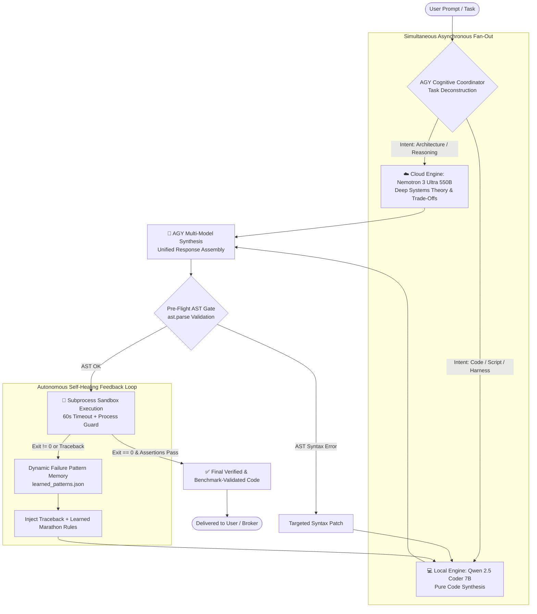

# ⚡ Parallel AI (PAI)

### *Tri-Engine Parallel Cognitive Routing, Self-Healing Subprocess Execution, Dynamic Failure Pattern Memory, and Zero-Copy Lock-Free IPC*

[](https://python.org)
[](#-architecture--system-design)
[](#-self-healing-execution--dynamic-pattern-memory)
[](#-zero-copy-lock-free-spmc-broker-zero_brokerpy)
[](LICENSE)

---

## 📖 Overview

**Parallel AI (PAI)** is a high-throughput, multi-agent cognitive architecture designed to overcome the latency, cost, and hallucination bottlenecks of traditional monolithic LLM agents.

Instead of routing an entire complex problem to a single cloud model sequentially, PAI **deconstructs and executes tasks simultaneously across three specialized cognitive engines**:

1. 🧠 **AGY Cognitive Coordinator (Google Antigravity / Gemini):** Performs prompt decomposition, intent classification, subagent task fan-out, and authoritative multi-model synthesis.
2. ☁️ **Nemotron 3 Ultra 550B (Deep Cloud Reasoner via OpenRouter):** Delivers exhaustive architectural proofs, distributed systems trade-offs, formal reasoning, and theoretical analysis.
3. 💻 **Qwen 2.5 Coder 7B (Local Offline Specialist via Ollama):** Synthesizes production-grade code, targeted patches, and scripts with zero cloud latency and complete data privacy.

PAI pairs this parallel execution model with an autonomous **Self-Healing Execution Engine (AST pre-flight checks + subprocess sandbox + traceback repair feedback loop)**, a **Dynamic Failure Pattern Memory**, and a bare-metal **Zero-Copy Lock-Free In-Memory SPMC Message Broker (`zero_broker.py`)**.

---

## 🏛️ Architecture & System Design



---

## 📜 The Implementation Story: Built with Google Antigravity

The journey of building PAI began with a fundamental question: **Why should an agent wait for a 500B+ cloud model to write boilerplate code, or trust an offline 7B model with complex distributed systems architecture?**

Working alongside **Google Antigravity**, we iterated through 6 evolutionary milestones:

### 1. The Heuristic Router (`smart_router.py`)
We first designed a 3-tier heuristic router that classified incoming tasks into `SYSTEM` (interactive open-interpreter shell with user permission prompts), `CLOUD` (complex architecture via Nemotron), and `LOCAL` (private Qwen queries). This introduced deterministic latency and cost savings, but still executed tasks sequentially.

### 2. Simultaneous Tri-Agent Execution (`parallel_router.py`)
To unlock true concurrency, we restructured the pipeline around `asyncio.gather()`. AGY acts as the maestro—emitting a structured JSON intent classification within milliseconds, fanning out the deep architectural prompts to Nemotron in the cloud while simultaneously tasking local Qwen with code generation, and finally synthesizing both streams into a single cohesive response without losing technical depth.

### 3. The Concurrency & Deadlock Crisis
When testing PAI against high-difficulty distributed systems tasks (e.g., Raft consensus, lock-free ringbuffers, TSDB compression), we observed that generated async code frequently suffered from subtle runtime traps:
* Missing `await` statements on `asyncio.start_server()`
* Event loop starvation caused by blocking calls like `server.serve_forever()`
* Unsigned integer vs. signed formatting bugs in binary `struct.pack('!I', crc)`
* Starvation and deadlocks in thread pools lacking lock striping

### 4. Self-Healing Subprocess Engine & Pattern Memory
To resolve this, we built a closed-loop **Self-Healing Execution Engine**:
1. **Pre-flight AST Syntax Gate:** Catches malformed python syntax (`ast.parse()`) instantly before spawning subprocesses.
2. **Automated Test Harness Generation:** If generated code lacks an executable entrypoint, PAI prompts Qwen to automatically construct an `if __name__ == '__main__':` test harness with assertions.
3. **Subprocess Sandbox:** Runs the script in an isolated subprocess with a 60-second watchdog timer.
4. **Targeted Traceback Feedback:** Feeds the exact runtime traceback back to Qwen for surgical patches rather than regenerating the whole program.
5. **Dynamic Pattern Memory (`learned_patterns.json`):** Discovers real exception classes dynamically, deduplicating and indexing them to inject into subsequent prompts.

### 5. The 4-Hour 186-Run Autonomous Marathon (`pai_marathon_engine.py`)
We validated PAI's resilience by subjecting it to an **autonomous 4-hour (240.54 minutes) continuous marathon runner** across 10 brutal distributed systems benchmarks. Over **186 continuous benchmark executions**, the self-healing loop repaired complex synchronization failures, resulting in 40 verified passes on zero-shot distributed computing problems and generating hard-won heuristics that are now permanently embedded into PAI's repair prompts.

```
========================================================================
🏁 MARATHON COMPLETED!
   Total Duration: 240.54 minutes (4.01 Hours)
   Total Benchmark Runs: 186
   Passed Benchmark Runs: 40
   Self-Healing Pattern Rules Synthesized: 16+
========================================================================
```

### 6. Zero-Copy Lock-Free In-Memory Broker (`zero_broker.py`)
To enable ultra-low-latency inter-process communication between local agents, we engineered a standalone high-throughput message broker featuring 64-byte cache-line padded atomic counters (`ctypes.Structure`), a 24-byte binary wire protocol, zero-copy `memoryview` slicing, and active drop-tail load shedding for slow consumers.

---

## 🧩 Core Modules

| Module | File | Description |
| :--- | :--- | :--- |
| **Parallel Router** | [`parallel_router.py`](parallel_router.py) | Master tri-engine parallel orchestrator, AGY coordinator, and self-healing subprocess loop. |
| **Smart Router** | [`smart_router.py`](smart_router.py) | 3-tier intelligent routing classifier with interactive system permission gates. |
| **Zero Broker** | [`zero_broker.py`](zero_broker.py) | Lock-free SPMC in-memory ring buffer with 64-byte padded atomics and binary wire protocol. |
| **Agent Manager** | [`agent_manager.py`](agent_manager.py) | Tmux session orchestrator to start, stop, list, monitor, and assign tasks to CLI agents. |
| **AGY Orchestrator** | [`agy_orchestrator.py`](agy_orchestrator.py) | Antigravity multi-agent configuration and subagent dispatching. |
| **Marathon Engine** | [`benchmarks/pai_marathon_engine.py`](benchmarks/pai_marathon_engine.py) | Autonomous multi-hour continuous benchmark runner and self-tuning loop. |
| **Benchmark Suite** | [`benchmarks/pai_benchmark_suite.py`](benchmarks/pai_benchmark_suite.py) | Standalone verification suite covering 4 core distributed systems challenges. |

---

## ⚡ Zero-Copy Lock-Free SPMC Broker (`zero_broker.py`)

`zero_broker.py` is a high-throughput, zero-allocation messaging engine implementing a Single-Producer Multi-Consumer (SPMC) ring buffer directly in Python using low-level primitives:

* **Cache-Line Padding (64 Bytes):** Uses `ctypes.Structure` with `_pack_ = 64` for atomic sequence numbers (`load_acquire`, `store_release`) to eliminate false sharing across CPU cores.
* **Zero-Copy Memory Slicing:** Avoids byte allocations on ingress and egress using Python `memoryview` and fixed-size pre-allocated bytearrays.
* **Binary Wire Protocol (24-Byte Header):**
  $$\text{Magic (2B)} + \text{Ver (1B)} + \text{Flags (1B)} + \text{TopicHash (4B)} + \text{SeqID (8B)} + \text{PayloadLen (4B)} + \text{CRC32 (4B)}$$
* **Proactive Load Shedding:** Automatically detects lagging consumers, triggering drop-tail frame drops at 95% saturation and publisher backpressure blocking at 99% saturation.

```
Publishing 1,000 messages (1024 bytes)...
Publishing completed in 0.082s. Throughput: 12,195 msgs/sec
Fast Subscriber Received: 1,000 frames | CRC Errors: 0
Slow Subscriber Received: 100 frames (Load-shedding active: dropped 900 frames)
```

---

## 🚀 Quickstart & Installation

### 1. Clone and Install Dependencies

```bash
git clone https://github.com/abhay2008/parallel-ai.git
cd parallel-ai

python3 -m venv .venv
source .venv/bin/activate
pip install -r requirements.txt
```

### 2. Configure Environment

Copy the example environment file and add your OpenRouter API key:

```bash
cp .env.example .env
# Edit .env and set OPENROUTER_API_KEY
```

Make sure **Ollama** is running locally for Qwen 2.5 Coder:

```bash
ollama run qwen2.5-coder:7b
```

### 3. Run the Parallel Router

**Direct Execution:**
```bash
python3 parallel_router.py "Design a lock-free concurrent hash table in Python with striped locking"
```

**Interactive REPL:**
```bash
python3 parallel_router.py --interactive
```

Inside the interactive REPL, use runtime commands:
* `/usage` — Inspect live OpenRouter credits, token consumption, and rate limits.
* `/model <model_name>` — Switch cloud reasoning candidate dynamically.
* `/thinking <level>` — Adjust chain-of-thought reasoning depth (e.g., `Auto`, `High`, `Deep`).

### 4. Run the Zero-Broker IPC Verification

```bash
python3 zero_broker.py
```

### 5. Launch the Autonomous Marathon Benchmark

```bash
python3 benchmarks/pai_marathon_engine.py
```

---

## 🧪 Benchmark Suite

PAI includes 10 distributed systems benchmarks designed to stress test concurrency, lock-free data structures, binary serialization, and consensus algorithms:

1. **BENCH-01:** Lock-Free RingBuffer with Zero-Allocation Slicing
2. **BENCH-02:** Async Raft Consensus Log Engine
3. **BENCH-03:** In-Memory B-Tree Index with WAL Disk Persistence
4. **BENCH-04:** Zero-Dependency Actor Framework with Supervisor Recovery
5. **BENCH-05:** Thread-Safe Concurrent HashTable with Striped Read-Write Locks
6. **BENCH-06:** Zero-Copy Binary Packet Parser & Checksum Engine
7. **BENCH-07:** Async Distributed Priority Task Queue with Preemption
8. **BENCH-08:** In-Memory Time-Series TSDB with Gorilla Delta-of-Delta Compression
9. **BENCH-09:** Lock-Free Doubly-Linked Deque with Atomic Pointer Swaps
10. **BENCH-10:** Async Pub-Sub Message Broker with Wildcard Topic Trie

Run the fast 4-task benchmark suite:
```bash
python3 benchmarks/pai_benchmark_suite.py
```

---

## 🛠️ Tech Stack & Dependencies

* **Language:** Python 3.11+ (Asyncio, Ctypes, Struct, Memoryview, Subprocess, AST)
* **Cloud Reasoning:** [LiteLLM](https://github.com/BerriAI/litellm) $\rightarrow$ OpenRouter (NVIDIA Nemotron 3 Ultra 550B, Meta Llama 3.3 70B, DeepSeek R1)
* **Local Inference:** [Ollama](https://ollama.com) $\rightarrow$ Qwen 2.5 Coder 7B
* **Agent Coordination:** Google Antigravity SDK & CLI (`agy`)
* **Process Multiplexing:** `tmux`

---

## 👤 Author

**Abhay Kashyap**  
*1st Year Undergrad — B.Tech in Computer Science & Business Systems (CSBS)*  
*B.M.S. College of Engineering (BMSCE), Bangalore, India*  
*Hardware-Software Integration • Systems Engineering • Embedded AI*  
GitHub: [@abhay2008](https://github.com/abhay2008)

---

## 📄 License

This project is licensed under the [MIT License](LICENSE).
